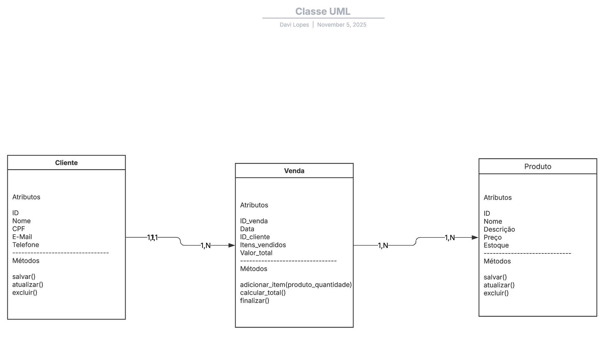
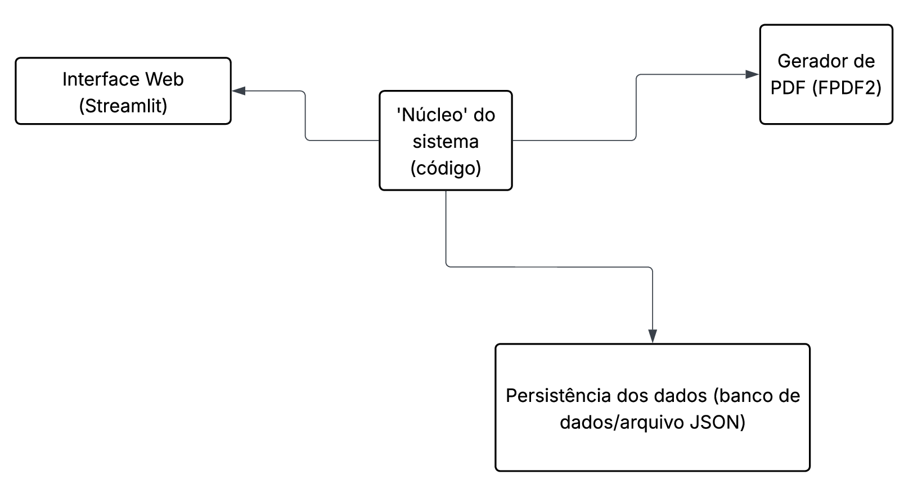

# Sistema de Vendas

Este repositório contém um Sistema de Vendas, feito para o trabalho do professor **Sandeison**, das matérias de **Engenharia de Software** e **Estrutura de Dados**.

# Diagramas UML

A seguir, é possível conferir os diagramas de caso de uso, classes e componentes, conforme solicitado pelo professor:

## Diagrama de caso de uso

## Diagrama de classes

## Diagrama de componentes

